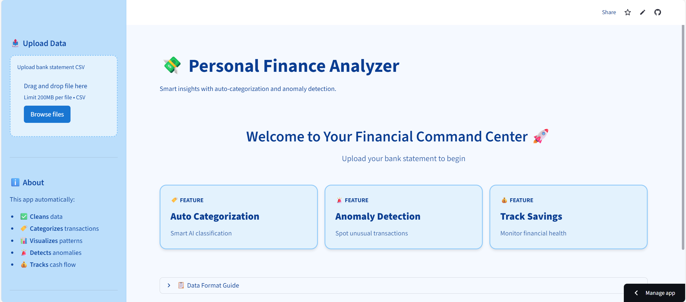
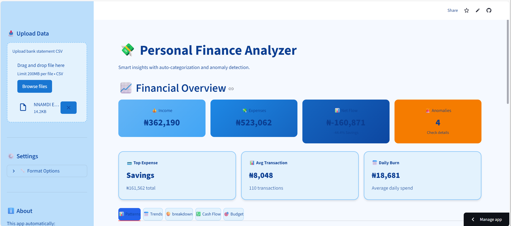
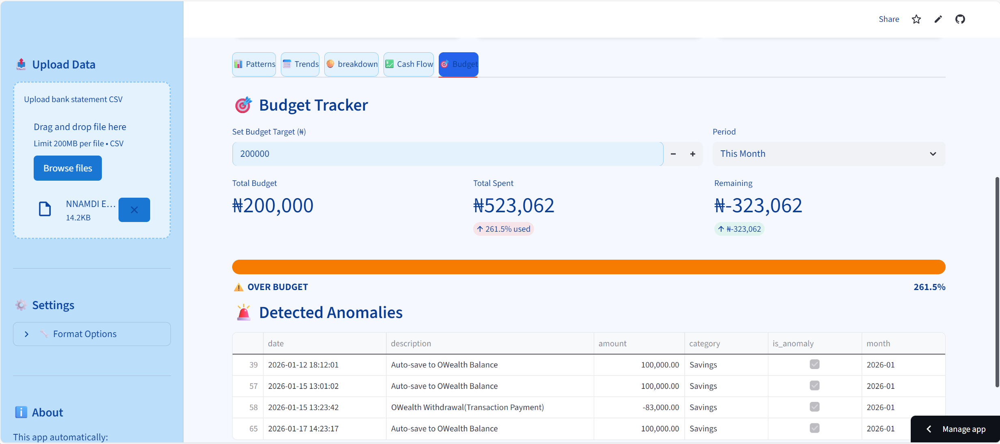

# 💸 Personal Finance & Expense Analyzer

A powerful, intelligent personal finance dashboard that automatically categorizes transactions, detects anomalies, and provides deep insights into your spending patterns.


## 🌟 Features

- **📤 Smart CSV Processing**: Automatically detects and maps various bank statement formats
- **🏷️ Intelligent Categorization**: Uses fuzzy matching to categorize transactions (Food, Transport, Utilities, etc.)
- **🚨 Anomaly Detection**: Statistical analysis to identify unusual transactions
- **📊 Interactive Visualizations**: 
  - Monthly spending trends
  - Category breakdowns
  - Income vs Expenses comparison
  - Distribution pie charts
- **💰 Financial Insights**:
  - Net cash flow tracking
  - Savings rate calculation
  - Monthly statistics
- **💾 Export Options**: Download processed data and summary reports

## 📸 Screenshots


### 📊 Command Center
*Your financial heartbeat at a glance. Instant access to key metrics, quick actions, and a high-level summary of your financial health.*


### 💰 Deep Dive Analysis
*Uncover the stories behind the numbers. Visualize spending trends, spot anomalies, and understand exactly where your money is going.*


### 🎯 Budget Enforcer
*Stay on track and never overspend again. Set targets, monitor real-time progress, and master your cash flow with precision.*



## 🚀 Quick Start

### Prerequisites

- Python 3.8 or higher
- pip package manager

### Installation

1. **Clone the repository**
```bash
git clone https://github.com/yourusername/personal-finance-analyzer.git
cd personal-finance-analyzer
```

2. **Create a virtual environment** (recommended)
```bash
# Windows
python -m venv venv
venv\Scripts\activate

# macOS/Linux
python3 -m venv venv
source venv/bin/activate
```

3. **Install dependencies**
```bash
pip install -r requirements.txt
```

4. **Run the application**
```bash
streamlit run app.py
```

The app will open in your default browser at `http://localhost:8501`

## 📁 Project Structure

```
personal-finance-analyzer/
│
├── app.py                  # Main Streamlit dashboard
├── README.md               # Project documentation
├── requirements.txt        # Python dependencies
├── .gitignore             # Git ignore rules
│
└── src/
    ├── __init__.py        # Package initializer
    └── load_data.py       # Data processing & analysis functions
```

## 📊 CSV Format

Your CSV should contain these columns (exact names may vary):

| Column | Alternative Names | Example |
|--------|------------------|---------|
| Date | transaction date, value date, posting date | 2024-01-15 |
| Description | narration, details, particulars | KFC Restaurant |
| Amount | debit, credit, value | 2500.00 |

**Sample CSV:**
```csv
Date,Description,Amount
2024-01-15,KFC Restaurant,2500
2024-01-16,Uber Trip,1200
2024-01-17,Salary Credit,150000
```

## 🛠️ Technologies Used

- **[Streamlit](https://streamlit.io/)**: Web framework for the dashboard
- **[Pandas](https://pandas.pydata.org/)**: Data manipulation and analysis
- **[Plotly](https://plotly.com/)**: Interactive visualizations
- **[RapidFuzz](https://github.com/maxbachmann/RapidFuzz)**: Fuzzy string matching for categorization
- **[NumPy](https://numpy.org/)**: Numerical computations

## 🎯 How It Works

1. **Data Loading**: Reads CSV and automatically detects column structure
2. **Data Cleaning**: 
   - Standardizes column names
   - Converts amounts to numeric format
   - Parses dates
   - Removes invalid entries
3. **Categorization**: Uses fuzzy matching against keyword dictionaries
4. **Anomaly Detection**: Applies Z-score analysis (3 standard deviations)
5. **Visualization**: Generates interactive charts and metrics
6. **Export**: Allows downloading processed data

## 🎨 Customization

### Adding Categories

Edit `CATEGORIES` dictionary in `src/load_data.py`:

```python
CATEGORIES = {
    "Your Category": ["keyword1", "keyword2", "keyword3"],
    # Add more categories...
}
```

### Adjusting Anomaly Threshold

Modify the `threshold` parameter in `detect_anomalies()`:

```python
df['is_anomaly'] = detect_anomalies(df, threshold=3)  # Default: 3 std dev
```

## 📝 Requirements

```txt
streamlit>=1.28.0
pandas>=2.0.0
plotly>=5.17.0
rapidfuzz>=3.0.0
numpy>=1.24.0
```

## 🤝 Contributing

Contributions are welcome! Please feel free to submit a Pull Request.

1. Fork the repository
2. Create your feature branch (`git checkout -b feature/AmazingFeature`)
3. Commit your changes (`git commit -m 'Add some AmazingFeature'`)
4. Push to the branch (`git push origin feature/AmazingFeature`)
5. Open a Pull Request

## 📄 License

This project is licensed under the MIT License - see the [LICENSE](LICENSE) file for details.

## 🙏 Acknowledgments

- Inspired by the need for simple, effective personal finance tracking
- Built with love using Python and Streamlit

## 📧 Contact

Your Name - [@yourtwitter](https://twitter.com/yourtwitter)

Project Link: [https://github.com/yourusername/personal-finance-analyzer](https://github.com/yourusername/personal-finance-analyzer)

---

⭐ If you found this project helpful, please give it a star!